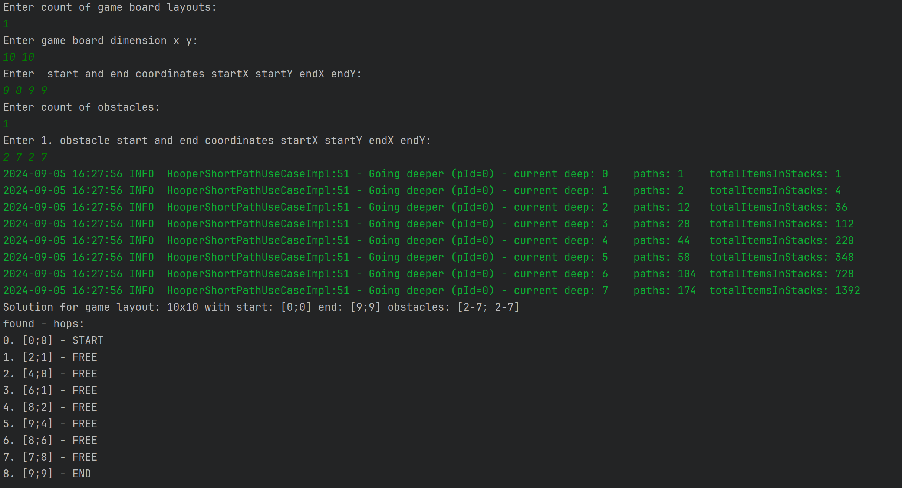

run by Main 

is possible choose from two modes:
- **auto** which can solve multiple games simultaneously with default movement ability
- **interactive** which can solve one game where the user can choose movement ability for each turn

# Example of console output

# Example of turns visualization

